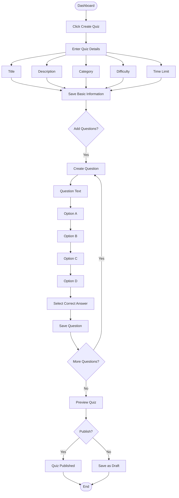
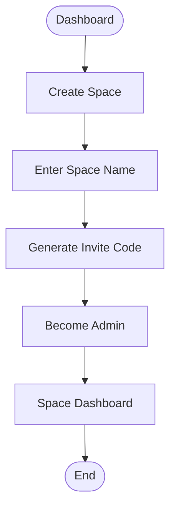
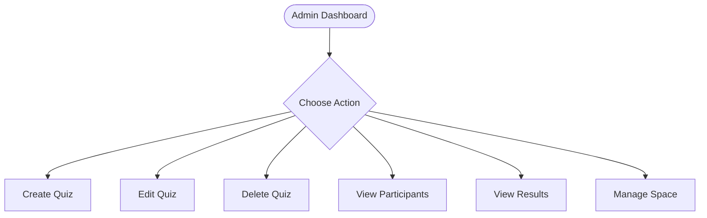

# Quiz Creation

```mermaid
flowchart TD

    A([Dashboard])

    A --> B[Click Create Quiz]

    B --> C[Enter Quiz Details]

    C --> D[Title]
    C --> E[Description]
    C --> F[Category]
    C --> G[Difficulty]
    C --> H[Time Limit]

    D --> I[Save Basic Information]
    E --> I
    F --> I
    G --> I
    H --> I

    I --> J{Add Questions?}

    J -->|Yes| K[Create Question]

    K --> L[Question Text]
    L --> M[Option A]
    M --> N[Option B]
    N --> O[Option C]
    O --> P[Option D]
    P --> Q[Select Correct Answer]

    Q --> R[Save Question]

    R --> S{More Questions?}

    S -->|Yes| K

    S -->|No| T[Preview Quiz]

    T --> U{Publish?}

    U -->|Yes| V[Quiz Published]

    U -->|No| W[Save as Draft]

    V --> X([End])
    W --> X
```

# Create Space

```mermaid
flowchart TD

    A([Dashboard])

    A --> B[Create Space]

    B --> C[Enter Space Name]

    C --> D[Generate Invite Code]

    D --> E[Become Admin]

    E --> F[Space Dashboard]

    F --> G([End])
```

# Admin Dashboard

```mermaid
flowchart TD

    A([Admin Dashboard])

    A --> B{Choose Action}

    B --> C[Create Quiz]

    B --> D[Edit Quiz]

    B --> E[Delete Quiz]

    B --> F[View Participants]

    B --> G[View Results]

    B --> H[Manage Space]
```