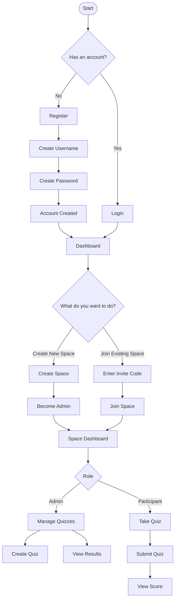

# Authentication Flow

```mermaid
flowchart TD

    A([Start])

    A --> B{Has an account?}

    B -->|Yes| C[Login]
    B -->|No| D[Register]

    D --> E[Create Username]
    E --> F[Create Password]
    F --> G[Account Created]

    G --> H[Dashboard]
    C --> H

    H --> I{What do you want to do?}

    I -->|Join Existing Space| J[Enter Invite Code]

    I -->|Create New Space| K[Create Space]

    K --> L[Become Admin]

    J --> M[Join Space]

    L --> N[Space Dashboard]
    M --> N

    N --> O{Role}

    O -->|Admin| P[Manage Quizzes]

    O -->|Participant| Q[Take Quiz]

    P --> R[Create Quiz]
    P --> S[View Results]

    Q --> T[Submit Quiz]

    T --> U[View Score]
```