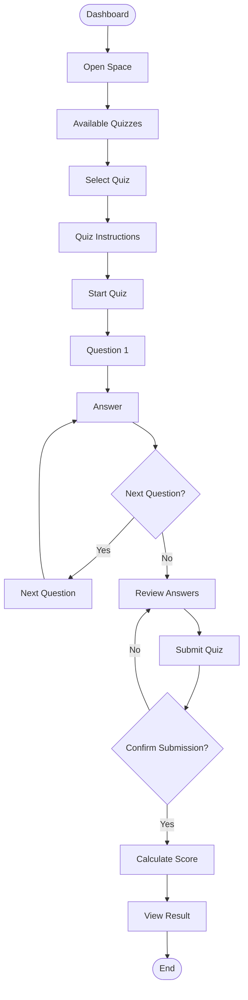
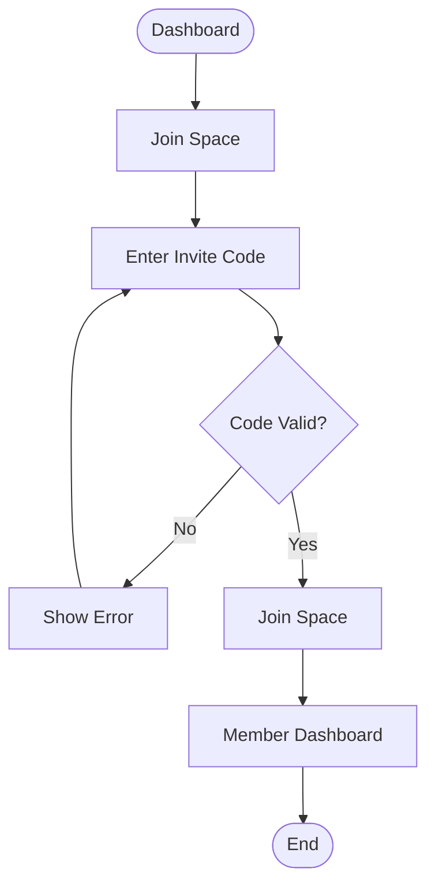

# Quiz Flow

```mermaid
flowchart TD

    A([Dashboard])

    A --> B[Open Space]

    B --> C[Available Quizzes]

    C --> D[Select Quiz]

    D --> E[Quiz Instructions]

    E --> F[Start Quiz]

    F --> G[Question 1]

    G --> H[Answer]

    H --> I{Next Question?}

    I -->|Yes| J[Next Question]

    J --> H

    I -->|No| K[Review Answers]

    K --> L[Submit Quiz]

    L --> M{Confirm Submission?}

    M -->|No| K

    M -->|Yes| N[Calculate Score]

    N --> O[View Result]

    O --> P([End])
```

# Join Space

```mermaid
flowchart TD

    A([Dashboard])

    A --> B[Join Space]

    B --> C[Enter Invite Code]

    C --> D{Code Valid?}

    D -->|No| E[Show Error]

    E --> C

    D -->|Yes| F[Join Space]

    F --> G[Member Dashboard]

    G --> H([End])
```